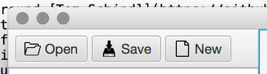

# SVG2FXML Extended

I know, not a creative name... but lets move past it.

This project is intended as a light-wrapper around [Tom Schindl](https://github.com/tomsontom)'s SVG2FXML Conversion JAR (documented on his [blog](http://tomsondev.bestsolution.at/2012/01/16/svg-for-fxml-conversion/); a part of his [e-fx-eclipse](https://github.com/tomsontom/e-fx-clipse) codebase), simply embedding information lost from the root tag of the input SVG document to the FXML document created by his conversion script.

This was last tested on his ```8.1-SNAPSHOT``` version, which should be included in binary form within this project. However, it was obtained from his [nightly builds](http://downloads.efxclipse.org/downloads/nightly/dist/) from the e-fx-clipse server.

## License Information

The e-fx-clipse codebase is under the [EPLv1](http://www.eclipse.org/legal/epl-v10.html). While the Application code provided here remains under the EPLv1, The code within the JavaFX Support Sub-project is Public Domain. See ```LICENSE.MD``` for more details.

## Project

The project is configured to be built with Gradle. The main directory of the repository contains all one should need to simply build this project, as well as its public domain support project. One command should do the whole thing.
	
	$ gradlew build
	
If all is good from the build process, you will have a build folder with the ```SVG2FXML-Extended-0.81.jar``` within it. This application can be run via the ```java -jar``` command easily, provided you include the original SVG2FXML Jar along side it.

### A creation story and a real world usage example.

This was built simply to be used within another project of mine, however I found a few odd things. There appears to be mixed information on how to do this online within JavaFX. All I wanted to do was use some SVG Icons I had as button icons.



After stumbling across Tom's blog, I started playing with his tool. The conversion worked flawlessly, and i was able to load up the Nodes from his FXML document easily, and was even able to use the following to convert the FXML SVGPath to an Image for an ImageView.

    WritableImage img = new WritableImage(1024, 1024);
    SnapshotParameters params = new SnapshotParameters();
    params.setFill(new Color(0, 0, 0, 0));
    params.setDepthBuffer(false);

    result.snapshot(params, img);
    ImageView iv = new ImageView();
    iv.setFitWidth(16.0);
    iv.setFitHeight(16.0);
    iv.setImage(img);
    button.setGraphic(iv);
               
However, I HATED that I had to hard code the SVG sizes, and in-fact my assumptions were incorrect. So my first step was to try and parse out sizes, however id have to first Parse the SVGPath data, I was no stranger to that, however i found a couple of my images didnt start and end within their bounds, some were beyond and others started at say 300x250 (TL) and ended at 507x980 (BR).

So I decided I had to embed the information from the SVG root tag's attributes. Thus this main project was born, a method to wrap Tom's application and inject my own data in to the process.

However it is fair to say, most of the time, FXML doesn't like one embedding data in to their "view" layer. After a lot of struggle, I found a way to embed this metadata, allowing me to have a single file represent this information. Create my own invisible tag. Read it out, and that is the result of the ```JavaFX Support``` sub-project.

After this wrapper was created, and some minor visual adjustments to make these images clearer at my desired 16x16 size, the code looks like this:

    int w = DEFAULT_WIDTH;
    int h = DEFAULT_HEIGHT;

    Data dataElement = (Data) result.lookup("#svg_root_element");

    if (dataElement != null) {
        String width = dataElement.get("width");
        String height = dataElement.get("height");

        if (!StringUtils.isEmpty(width)) {
            w = parse(width, w);
        }
        if (!StringUtils.isEmpty(height)) {
            h = parse(height, h);
        }
    }

    BoxBlur boxBlur = new BoxBlur();
    boxBlur.setWidth(10);
    boxBlur.setHeight(10);
    boxBlur.setIterations(1);

    result.setEffect(boxBlur);
    WritableImage img = new WritableImage(w, h);
    SnapshotParameters params = new SnapshotParameters();
    params.setFill(new Color(0, 0, 0, 0));
    params.setDepthBuffer(false);

    result.snapshot(params, img);
    ImageView iv = new ImageView();
    iv.setFitWidth(16.0);
    iv.setFitHeight(16.0);
    iv.setImage(img);
    button.setGraphic(iv);
